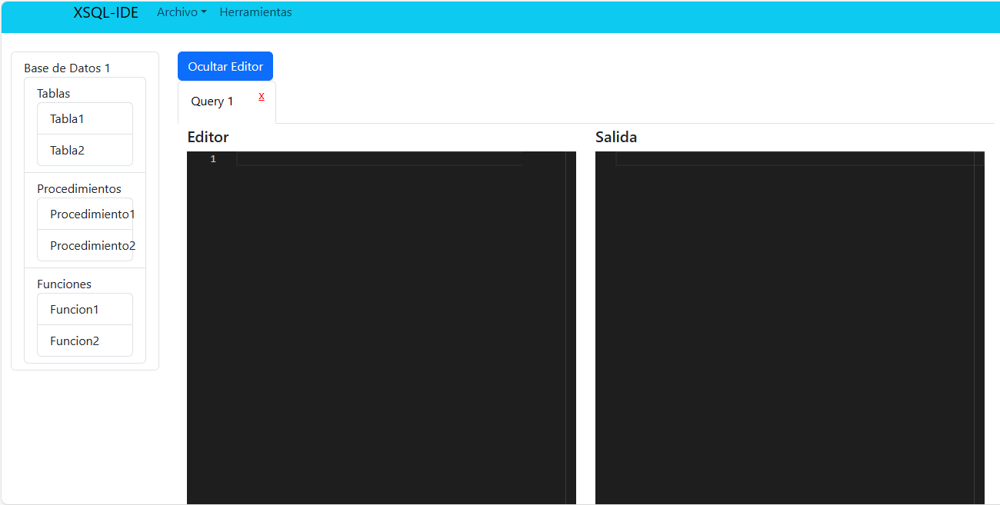

# MANUAL DE USUARIO

 Tenemos una interfaz amigable para el usuario en la cual podemos encontrar, el editor de texto donde este podra ingresar cadenas de texto que se podran ejecutar cuando se cumpla con la sintaxis correcta. 

 Tendremos tambien la salida, en esta el usuario podra visualizar las consultas que se hagan a la base de datos, visto de otra manera cada vez que se ejecute un select.

En archivo tendremos un menu desplegable en el cual se nos mostraran distintas opciones que estan a la dispocion del usuario y cada una cumple con la finalidad explicita que se inidica en cada uno de los textos correspondientes a un archivo 

Al dar click en Herramientas se nos despliega un panel el cual nos brinda mas opciones de interaccion en las cuales podemos encontrar 3 menus desplegables y dos botones los cuales cumplen con la funcionalidad que cada uno indica 

En el primer menu desplegable nos encontramos con las opciones que acompañan a cada una de las acciones que se pueden realizar con una base de datos 

En el segundo menu desplegable encontramos las opciones de nuevo Query el cual al dar click crea una nueva pestaña y esto se puede hacer cunatas veces el usuario lo requiera  

La opcion Ejecutar Query realizara ñas acciones que se encuentren en el editor de texto del Query actual de ocurrir algun error durante la ejecucion, este se nos mostrara en consola, la cual se encuentra debajo del editor de texto.

En el tercer menu desplegable nos encontramos con cada uno de los reportes que el usuario pueda necesitar como lo son el reporte errores, tabla de simbolos y arbol AST los cuales podremos visualizar debajo de nuestra consola 

