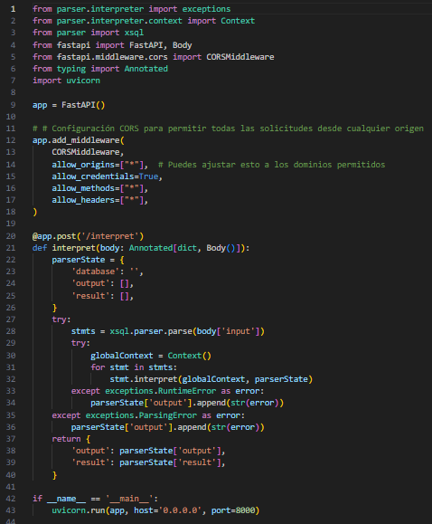

# MANUAL TECNICO

## main.py
 

Podemos encontrar la aplicacion web, realizada con FastAPI que proporciona un punto de enlace (/interpret) para interpretar comandos SQL personalizados.

Se importan diferentes módulos y clases necesarios para la aplicación, como el intérprete, el contexto de interpretación, FastAPI para crear la aplicación web, Body para manejar la entrada del cuerpo en las solicitudes, y CORSMiddleware para configurar el manejo de solicitudes entre dominios.

Se configura el middleware CORS para permitir solicitudes desde cualquier origen (*). 

Se define una función para manejar solicitudes POST en el camino /interpret. Recibe un cuerpo JSON que se espera que contenga un campo llamado 'input'.

Se inicializa un diccionario parserState que se utilizará para almacenar información sobre el estado del parser.

Se intenta analizar y luego interpretar los comandos SQL proporcionados en el campo 'input' del cuerpo de la solicitud. Los errores de análisis (ParsingError) y los errores de ejecución (RuntimeError) se capturan y se agregan a la lista parserState['output'].

Se devuelve una respuesta JSON que contiene la salida del parser (parserState['output']) y los resultados obtenidos (parserState['result']).

Si el script se ejecuta directamente (no se importa como un módulo), la aplicación se inicia utilizando el servidor Uvicorn en el host '0.0.0.0' y el puerto 8000.

## lexRules.py

Aca se nos presenta el analizador Lexico(lexer) escrito utilizando la herramienta PLY (Python Lex-Yacc)

Se define un diccionario llamado reserved que asigna palabras clave del lenguaje a sus respectivos tokens. Estas palabras clave son específicas de XSQL.

Se define una lista llamada tokens que contiene los nombres de los tokens reconocidos por el analizador léxico. Además de palabras clave, hay tokens para operadores, literales (números, cadenas), y otros elementos.

La lista literals contiene caracteres individuales que se tratan como literales y no se procesan como tokens separados. Estos incluyen operadores y otros caracteres especiales. 
 Ya con esto PLY se encargará de utilizar estas definiciones para construir un analizador léxico funcional.

 ## xsql.py 
 
 
 Es un analizador sintáctico (parser) escrito usando PLY (Python Lex-Yacc) para XSQL.
 
 El parser toma una secuencia de tokens generada por el lexer (analizador léxico) y crea una estructura de árbol de sintaxis abstracta (AST) que representa la estructura gramatical del código fuente

 Se importan varios módulos y clases necesarios para el analizador sintáctico, incluyendo el lexer, clases de expresiones (expr), clases de sentencias (stmt), reglas léxicas, y excepciones personalizadas.

 Se crea el analizador léxico (lexer) usando las reglas definidas en el módulo lexRules.

 Se define la precedencia de los operadores para resolver ambigüedades en la gramática.

 Se definen varias reglas de producción utilizando la sintaxis de PLY. Cada regla describe la estructura de una construcción sintáctica específica de XSQL.
 
 Las funciones que comienzan con p_ definen el comportamiento asociado con cada regla de producción.

 La función p_error maneja los errores sintácticos e informa sobre el problema encontrado.

 Se crea el analizador sintáctico (parser) utilizando las reglas definidas (parser = yacc.yacc()).

## context.py

Se implementa la clase Symbol y la clase Context, que se utilizan para gestionar los símbolos y el contexto de ejecución en el lenguaje
XSQL 

### Symbol:

- Representa un símbolo en el contexto de ejecución.
- Almacena la clave del símbolo (key), su valor (value), y el tipo del símbolo (t).
- El método update permite actualizar el valor del símbolo, asegurando que el nuevo valor sea del mismo tipo que el tipo original del símbolo.

### Context:

- Representa el contexto de ejecución, que incluye información sobre los símbolos declarados.
- Almacena un diccionario (symbols) que mapea claves de símbolos a instancias de la clase Symbol.
- El método declare se utiliza para declarar un nuevo símbolo en el contexto actual.
- El método set busca un símbolo por clave y actualiza su valor. Si la clave no existe, se genera un error. Este método busca en el contexto actual y en todos los contextos anteriores.
- El método get busca un símbolo por clave en el contexto actual y en todos los contextos anteriores. Si no se encuentra, se genera un error.

## symbol.py 

Se implementan varias clases de símbolos (Symbol) especializadas para manejar diferentes tipos de datos, como VarChar, Integer, Decimal, Date, y DateTime. Cada una de estas clases representa un tipo específico de símbolo con sus propiedades y métodos asociados.

### Symbol (clase abstracta):

- Representa un símbolo genérico en el contexto de ejecución.
- Contiene una clave (key), un tipo (t), y un valor (value).
- Define un método abstracto update que se utiliza para actualizar el valor del símbolo. También contiene un método matchType que verifica si un valor tiene el tipo correcto.

### VarChar:

- Representa un símbolo de tipo cadena de longitud fija (VARCHAR).
- Almacena un valor de cadena y tiene una longitud máxima fija.
- El método update asegura que el valor sea de tipo cadena y ajusta la longitud si es necesario.

### Integer:

- Representa un símbolo de tipo entero (INT).
- Almacena un valor entero o de punto flotante.

### Decimal:

- Representa un símbolo de tipo decimal (DECIMAL).
- Almacena un valor de punto flotante o entero.

### Date:

-Representa un símbolo de tipo fecha (DATE).
-Almacena un valor de fecha y proporciona una representación de cadena formateada.

### DateTime:

- Representa un símbolo de tipo fecha y hora (DATETIME).
- Almacena un valor de fecha y hora y proporciona una representación de cadena formateada.

## expr.py
 

 Implementa clases de expresiones (Expr) que se utilizan para construir y evaluar expresiones en el lenguaje XSQL 

### Expr (Clase abstracta):

- Define la interfaz para las expresiones, con métodos abstractos interpret y __str__.

### Literal(Expr):

- Representa un valor literal en una expresión.
- Almacena el valor y la posición en el código fuente.
- El método interpret devuelve el valor literal.

### Binary(Expr):

- Representa una operación binaria en una expresión.
- Almacena el operador, el operando izquierdo y el operando derecho, así como la posición en el código fuente.
- El método interpret evalúa la operación binaria y devuelve el resultado.

### Unary(Expr):

- Representa una operación unaria en una expresión.
- Almacena el operador y el operando, así como la posición en el código fuente.
- El método interpret evalúa la operación unaria y devuelve el resultado.

### Symbol(Expr):

- Representa un símbolo o variable en una expresión.
- Almacena la clave del símbolo y la posición en el código fuente.
- El método interpret obtiene el valor asociado al símbolo en el contexto.

Estas clases son fundamentales para la interpretación de expresiones en el lenguaje XSQL.

Se utilizan para construir y evaluar expresiones matemáticas y lógicas en el contexto de la ejecución del programa. Además, el código maneja posiciones en el código fuente para facilitar la identificación de errores y la depuración.

## operations.py 

Contiene funciones auxiliares y utilidades para realizar operaciones y manipulaciones en el lenguaje.

### isDate(left, right) -> bool:

 Verifica si al menos uno de los operandos es de tipo fecha (date o datetime).

### bothAreNumbers(left, right) -> bool:

 Verifica si ambos operandos son números (ya sea int o float).
 
### isString(left, right) -> bool:

 Verifica si al menos uno de los operandos es de tipo cadena (str).

### Operaciones aritméticas (sum, sub, mult, div):

 Realizan las operaciones de suma, resta, multiplicación y división, respectivamente.
 Manejan casos específicos para concatenación de cadenas y otros escenarios.

### castRelationalOperands(left, operator:str, right, position:tuple) -> tuple:

 Realiza la conversión de operandos para operaciones relacionales, como <, >, <=, >=, ==, !=.
 Maneja la conversión de cadenas a fechas o datetimes si es necesario.

### wrapInSymbol(key:str, value:Any, t:str, length:int|None=None) -> symbol.Symbol:

 Crea un objeto de símbolo (Symbol) según el tipo especificado (t) y opcionalmente la longitud para cadenas de longitud fija.
Utiliza las clases especializadas (Integer, Decimal, VarChar, Date, DateTime) para crear el símbolo.

### cast(value:str, t:str) -> Any:

 Realiza la conversión de un valor (value) al tipo especificado (t).
 Maneja conversiones para enteros, decimales y cadenas.

## stmt.py

 

 Define una serie de clases que representan diversas instrucciones del lenguaje XSQL 

 Estas clases heredan de la clase abstracta Stmt, que tiene un método abstracto interpret. Cada clase concreta implementa este método para llevar a cabo la interpretación de la instrucción correspondiente.

 Estas clases son parte de nuestro intérprete que procesa el código fuente XSQL y ejecuta las acciones correspondientes en un contexto de ejecución. El intérprete utiliza funciones definidas en los módulos ddl, dml, ciclo, expr, operations, symbol y context para llevar a cabo las operaciones específicas de cada instrucción.

## ddl.py

Implementa operaciones DDL (Data Definition Language) para manipular la estructura de la base de datos.

### createBase(identifier:str):

- Crea una nueva base de datos con el identificador proporcionado.
- Crea un nuevo elemento XML para representar la base de datos y lo guarda en un archivo.

### createTable(tableName:str, columnList:list[dict], database:str):

- Crea una nueva tabla en la base de datos especificada.
- Agrega un elemento XML para representar la tabla con sus columnas al archivo de la base de datos.

### alterAdd(tableName:str, column:dict, database:str):

- Agrega una nueva columna a una tabla existente en la base de datos especificada.
- Modifica el elemento XML de la tabla para incluir la nueva columna.

### alterDrop(tableName:str, column:str, database:str):

- Elimina una columna de una tabla existente en la base de datos especificada.
- Modifica el elemento XML de la tabla para excluir la columna y elimina las celdas correspondientes en las filas existentes.

### truncate(tableName:str, database:str):

- Elimina todos los registros de una tabla existente en la base de datos especificada.
- Borra todas las filas dentro del elemento XML de registros de la tabla.

Estas funciones utilizan el módulo common para leer y escribir información en archivos XML. Además, se manejan excepciones personalizadas, como RuntimeError, para manejar casos específicos de error durante la ejecución de estas operaciones DDL.

## dml.py

Implementa operaciones DML (Data Manipulation Language) para manipular los datos en la base de datos.

### insert(context:Context, database:str, tableName:str, selection:list, values:list, position:tuple):

- Inserta un nuevo registro en la tabla especificada.
- Verifica que las columnas obligatorias estén presentes y asigna los valores proporcionados.
- Actualiza el archivo XML de la base de datos.

### interpretReturnExprs(returnExprs:list[tuple[expr.Expr, str|None]], recordContext:Context, columnList, position:tuple) -> list[str]:

- Interpreta las expresiones de retorno para obtener los valores correspondientes en el contexto del registro.
- Se utiliza en la función selectFrom para obtener los valores de las columnas seleccionadas.

### getTableHeader(returnExprs:list[tuple[expr.Expr, str|None]], columnList) -> list[str]:

- Obtiene la cabecera de la tabla según las expresiones de retorno.
- Se utiliza en la función selectFrom para obtener la cabecera de los resultados.

### selectFrom(context:Context, database:str, tables:list[str], returnExprs:list[tuple[expr.Expr, str|None]], condition:expr.Binary|None, position:tuple) -> dict[str, list]:

- Realiza una selección de datos desde una o varias tablas según las condiciones y expresiones de retorno proporcionadas.
- Retorna un diccionario que contiene la cabecera y los registros seleccionados.

### delete(context:Context, database:str, tableName:str, condition:expr.Binary|None, position:tuple):

- Elimina registros de la tabla especificada según la condición proporcionada.
- Actualiza el archivo XML de la base de datos.

### update(context:Context, database:str, tableName:str, condition:expr.Binary|None, lista:list):

- Actualiza registros en la tabla especificada según la condición y la lista de asignaciones proporcionadas.
- Si la condición es None, se actualizan todos los registros.
Actualiza el archivo XML de la base de datos.

 Estas funciones trabajan con la estructura XML de la base de datos y utilizan la lógica de contexto y expresiones interpretadas para manipular los datos.

 Además, manejan excepciones personalizadas, como RuntimeError, para informar sobre posibles problemas durante la ejecución de estas operaciones DML.

 ## common.py
 

 Proporciona funciones de utilidad para manipular y acceder a bases de datos almacenadas en archivos XML

### writeTreeToFile(tree: ET.ElementTree, database: str):

Escribe el árbol XML en un archivo para una base de datos específica.
El archivo se guarda en la ruta especificada en la configuración (config.pathToDatabases) con el nombre de la base de datos y la extensión ".xml".

### getDatabaseElementTree(database: str) -> ET.ElementTree:

Obtiene el árbol de elementos XML correspondiente a una base de datos específica.
Carga el árbol desde el archivo XML de la base de datos.

### getTableColumns(table: ET.Element) -> dict:

Obtiene un diccionario que contiene las columnas de una tabla XML junto con sus atributos.
Utiliza el elemento XML de la tabla y extrae información de las columnas.

### getType(t: str) -> Any:

Devuelve el tipo de datos de Python correspondiente a un tipo de dato específico utilizado en la base de datos.
Los tipos de datos admitidos son 'int', 'decimal', 'date', 'datetime', y 'str'.

Estas funciones son fundamentales para la manipulación de datos en la base de datos XML. Proporcionan una interfaz para escribir y leer archivos XML, así como para obtener información sobre la estructura de las tablas. Además, la función getType facilita la conversión entre tipos utilizados internamente en el programa y tipos de Python correspondientes.